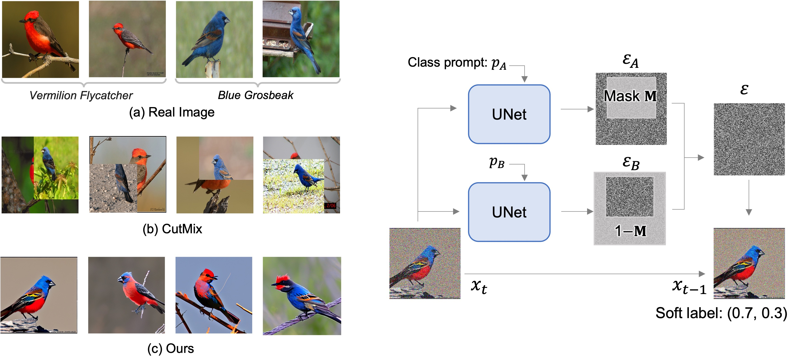

# NoiseCutMix: A Novel Data Augmentation Approach by Mixing Estimated Noise in Diffusion Models [[S.Takezaki+, ICCVW]()]

Shumpei Takezaki\*, Ryoma Bise, Shinnosuke Matsuo\* (\* Equal contribution)




>In this study, we propose a novel data augmentation method that introduces the concept of CutMix into the generation process of diffusion models, thereby exploiting both the ability of diffusion models to generate natural and high-resolution images and the characteristic of CutMix, which combines features from two classes to create diverse augmented data. Representative data augmentation methods for combining images from multiple classes include CutMix and MixUp. However, techniques like CutMix often result in unnatural boundaries between the two images due to contextual differences. Therefore, in this study, we propose a method, called NoiseCutMix, to achieve natural, high-resolution image generation featuring the fused characteristics of two classes by partially combining the estimated noise corresponding to two different classes in a diffusion model. In the classification experiments, we verified the effectiveness of the proposed method by comparing it with conventional data augmentation techniques that combine multiple classes, random image generation using Stable Diffusion, and combinations of these methods.

## Requirements
* Linux and Windows are supported, but we recommend Linux for performance and compatibility reasons.
* High-end NVIDIA GPUs and [Nvidia Driver](https://documentation.ubuntu.com/server/how-to/graphics/install-nvidia-drivers/).
* 64-bit [Python](https://www.python.org/) 3.9 and [PyTorch](https://pytorch.org) 2.4.1 and [Diffusers](https://github.com/huggingface/diffusers) 0.25.1
* (Recommend) [uv](https://github.com/astral-sh/uv) for creating virtual enviroments.

## Getting started (on uv)
```.bash
git clone https://github.com/shumpei-takezaki/NoiseCutMix.git
cd NoiseCutMix
uv venv && uv sync # create enviroments
source .venv/bin/activate # activate
```

# Download pretrained weights for stable diffusion
[Diff-Mix](https://github.com/Zhicaiwww/Diff-Mix/) provides the lora weights fine-tuned on the full dataset in case for fast reproducation on given datasets. One can download using the following link, and unzip the file into dir `ckpts` and the file structure look like:

```
ckpts
├── cub                                                                                                                                                                                                                                          
│   └── shot-1-lora-rank10
│       ├── learned_embeds-steps-last.bin                                                                                                                                                                                                        -packages/
│       └── pytorch_lora_weights.safetensors
└── put_finetuned_ckpts_here.txt
```

| Dataset | ckpts                                                  |
|---------|---------------------------------------------------------------------|
| CUB     | [google drive](https://drive.google.com/file/d/1AOX4TcXSPGRSmxSgB08L8P-28c5TPkxw/view?usp=sharing) |
| Flower  | [google drive](https://drive.google.com/file/d/1hBodBaLb_GokxfMXvQyhr4OGzyBgyBm0/view?usp=sharing) |
| Aircraft| [google drive](https://drive.google.com/file/d/19PuRbIsurv1IKeu-jx5WieocMy5rfIKg/view?usp=sharing) |

If you want to perform fine-tuning on their own datasets, please see original repository, [Diff-Mix](https://github.com/Zhicaiwww/Diff-Mix/blob/master/README.md#customized-fine-tuning) 

# Usage
If just generate images:
```.bash
python generation.py --output_dir=./outputs --device=cuda --data_name=cub --ckpt_path=./ckpts/cub/shot-1-lora-rank10 --num_gen=8 --guidance_scale=7.5 --num_inference_steps=25 --alpha=1.0
```

If make augmented images, masks, and soft labels,
```.bash
python augmentation.py --output_dir=./outputs --device=cuda --data_name=cub --ckpt_path=./ckpts/cub/shot-1-lora-rank10 --batch_size=8 --num_aug=1000 --guidance_scale=7.5 --num_inference_steps=25 --alpha=1.0
```
`image` and `mask` folder, and `soft_label.npy`

## Citation
coming soon..

## Acknowledgmentnts
This project is built upon the repository [Diff-Mix](https://github.com/Zhicaiwww/Diff-Mix/) and [Diffusers](https://github.com/huggingface/diffusers). Special thanks to the contributors.
